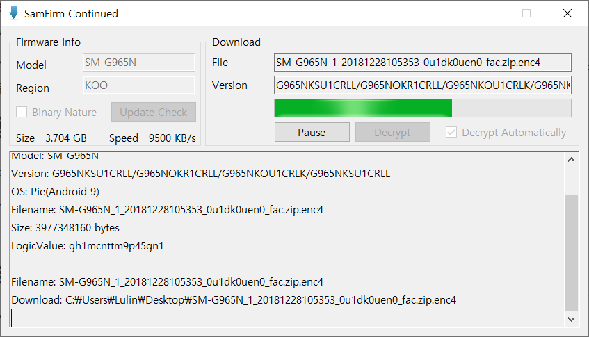
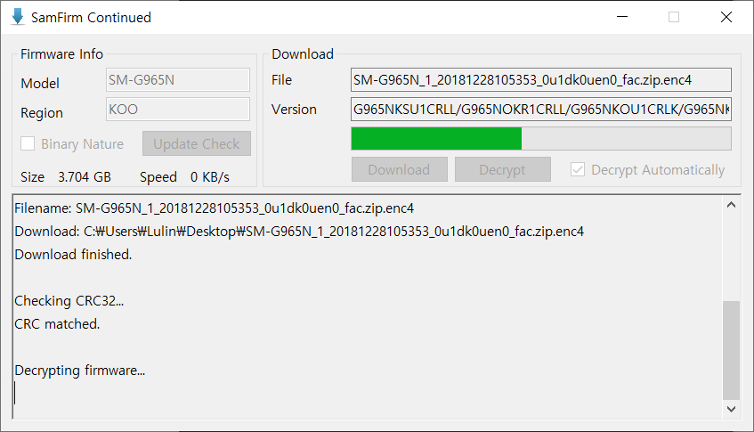
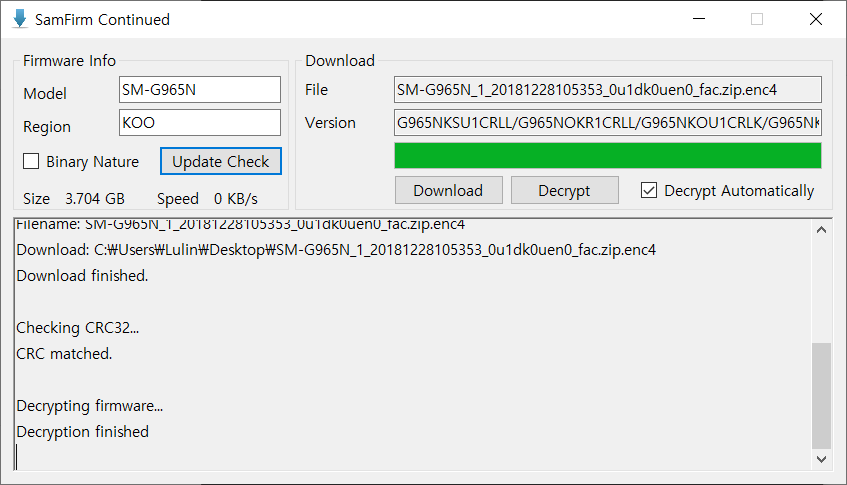

## SamFirm-continued Development End

```
SamFirm-continued officially ended its development.
This is a decision that I made because I couldn't continue to develop for my own personal reasons.
```


# SamFirm-continued

> This is a SamFirm extension support project.

SamFirm is a program that lets you download stock firmware for your Samsung smartphone. It was first posted to the [XDA Forum](https://forum.xda-developers.com/galaxy-tab-s/general/tool-samfirm-samsung-firmware-t2988647), and it was very helpful to many people, including me.

However, the update has been down since 2016, .NET Framework 4 or later is not supported and non-up-to-date firmwares can't download anymore. So I used [updato.com](https://updato.com/) instead. This is an archive of firmware for each model, which allows users to download firmware that has been released so far without a subscription or speed limit, but the latest firmware is not apply quickly.

Therefore, using the source code posted on [GitHub](https://github.com/eladkarako/SamFirm-Source), I decided to change the ".NET Framework" to the latest version, delete the inoperable or unnecessary features, and make the existing difficult usage as easy as possible.

I hope this project will be useful to many users. 😎

## Project Introduction

- Motive
  - I've started to improve the SamFirm program to make it work today.
- Purpose
  - It is easy to download the latest stock firmware.
- Main functions
  - Latest firmware check, encrypted file download, decryption

## Build Status

[](https://github.com/Lulin-Pollux/SamFirm-continued/releases/latest)
[](https://www.codacy.com/manual/Lulin/SamFirm-continued?utm_source=github.com&amp;utm_medium=referral&amp;utm_content=LulinPollux/SamFirm-continued&amp;utm_campaign=Badge_Grade)


 

## How to Install

1. Click the Release badge above or the [Release link](https://github.com/Lulin-Pollux/SamFirm-continued/releases/latest).
2. Download the latest version. (Latest Release)
3. Check that .NET Framework 4.7, [Visual C++ 2010 x86](http://www.microsoft.com/ko-kr/download/details.aspx?id=5555), [Visual C++ 2008 x86](https://www.microsoft.com/ko-kr/download/details.aspx?id=5582) are installed. Please download and install the missing parts by clicking each link or search on google.

## How to Use, Example

1. Enter the model name and region code, and click the Update Check button. Additional PIT files can be downloaded when checking the 'Binary Nature'.

   

2. Click the Download button. Decrypt automatically when checking the 'Decrypt Automatically'.

   

3. Perform the CRC32 inspection automatically.

   

4. The downloaded file is encrypted. If you checked for automatic decryption, perform the decryption process automatically, but click the Decrypt button to manually do so.

   

5. The download is complete, there is a archive file and an encryption file. Unzip the firmware file and use it, and encryption file can be deleted or stored.

   

## Functions

- Check the latest firmware for each variant.
- One-click Download the Latest Firmware.
- CRC32 Inspection.
- Automatically decrypt.

## API, Framework

- .NET Framework 4.7.2
- NuGet Packages
  - [Microsoft-WindowsAPICodePack-Core](https://www.nuget.org/packages/Microsoft-WindowsAPICodePack-Core/) 1.1.3.3
  - [Microsoft-WindowsAPICodePack-Shell](https://www.nuget.org/packages/Microsoft-WindowsAPICodePack-Shell/) 1.1.3.3
- DLL
  - AgentModule.dll
  - CommonModule.dll
  - GlobalUtil.dll

## develop environment

- S/W develop environment
  - Visual Studio 2019 Community (16.0.2)
  - .NET Framework 4.7.2
  - C# Language (x86 Build)
- setting up development environment
  1. Download the code as a clone, fork, or archive file from the repository.
  2. Make sure that the .NET Framework 4.7.2 Development Tool is installed. If not, install.
  3. Open the solution file (.sln) with Visual Studio 2019.
  4. Start coding!

## Developer information and credits

- Developer
  - Lulin Pollux - [GitHub Profile](https://github.com/LulinPollux), [kistssy+dev@gmail.com](mailto:kistssy+dev@gmail.com)
- Credits
  - Original project: [eladkarako/SamFirm-Source](https://github.com/eladkarako/SamFirm-Source)
  - XDA Forum: [forum.xda-developers.com/...](https://forum.xda-developers.com/galaxy-tab-s/general/tool-samfirm-samsung-firmware-t2988647) (zxz0O0)

## contribution method

1. Fork [this project](https://github.com/LulinPollux/SamFirm-continued).
2. Create a new branch or use the master branch in the GitHub Desktop.
3. Commit the modification.
4. Push on the selected branch.
5. Please send a pull request.

## License

MIT License © Lulin Pollux

You can find more information in `LICENSE`.
